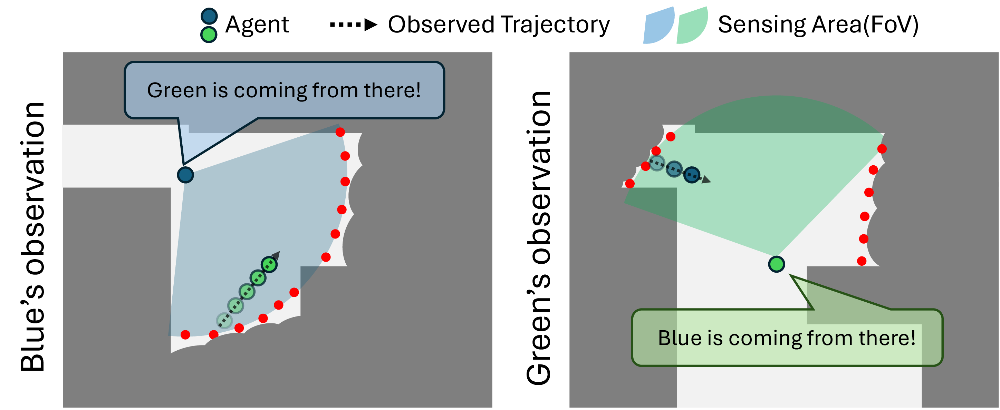
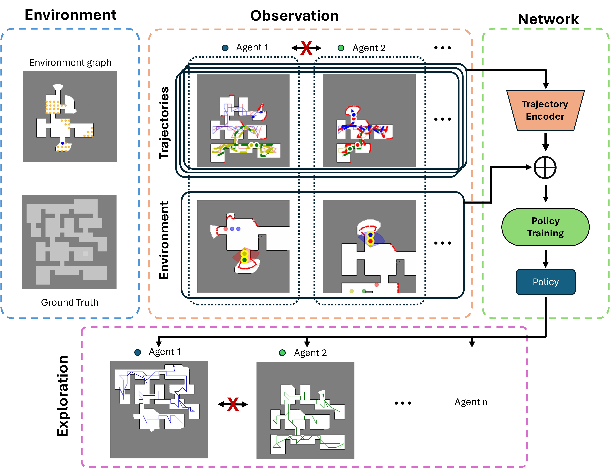
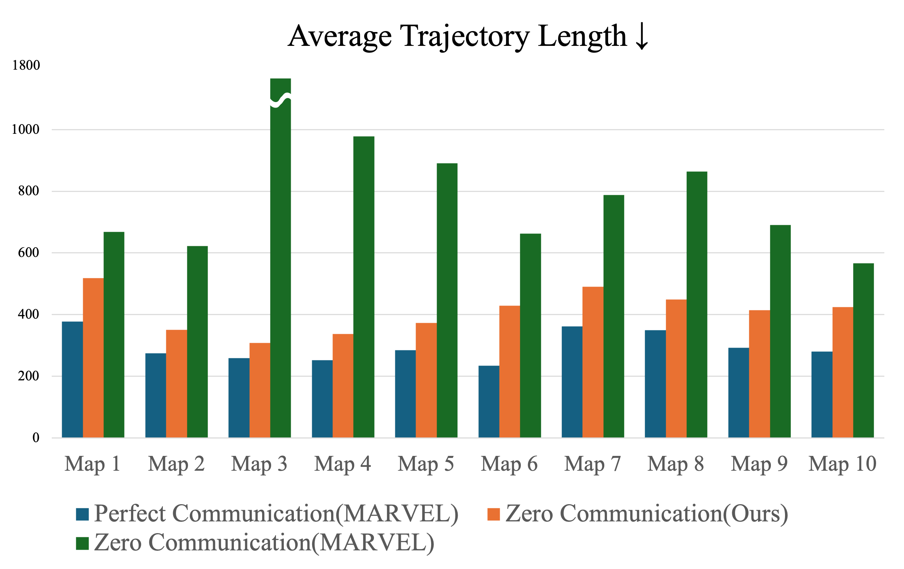

# 🤖 MARVEL: Multi-Agent Reinforcement Learning for Communication-Free Exploration

## ✨ Our Proposed Method
### 🎬 데모 영상
6대의 로봇이 **통신 없이** 서로의 궤적만 관찰하여 협력 탐사를 수행하는 모습

<div align="center">
  
</div>

### 🔍 문제 정의
기존 방법들은 ```완전한 통신(Perfect Communication)```을 전제로 하지만, 실제 환경에서는 통신 인프라 부족이나 무선 환경 불안정으로 현실적이지 않습니다.

<div align="center">
  
  <p><i>통신이 끊겼을 때, 다른 로봇의 이동 궤적만 보고도 효율적인 탐사가 가능할까?</i></p>
</div>

### 🧠 핵심 아이디어
시야(FoV) 안으로 들어온 다른 로봇들의 ```최근 궤적(위치, 속도, 방향)```을 Transformer 기반 encoder로 인코딩하여, 통신 없이도 **어디서 왔는지 & 어디로 향하는지**를 파악하고 중복 탐사를 회피합니다.

<div align="center">
  
  <p><i>Trajectory Encoder → Graph Fusion → Policy Network 파이프라인</i></p>
</div>

---

## 📖 프로젝트 개요

- **환경**: 90m × 90m 실내 환경, 제한된 시야각(FOV 120°, 센서 범위 10m)
- **목표**: 여러 대의 로봇이 미지의 환경을 **가장 짧은 궤적**으로 탐사하여 **90% coverage** 달성
- **알고리즘**: SAC 기반 Multi-Agent RL + Trajectory Observation
- **비교대상**: 완전한 통신(Perfect Communication)을 가정한 기존 연구 MARVEL 개선 (https://github.com/marmotlab/MARVEL)
---

## 🛠️ 환경 세팅 (Setup)
```bash
conda env create -f marvel.yml
conda activate marvel
```
> **Tested Environment**: Ubuntu 22.04, CUDA 12.4

---

## 🚀 학습 (Training)
```bash
python driver.py
```
- ⚙️ **학습 설정**: `parameter.py`에서 변경
- 💾 **체크포인트**: `model/<FOLDER_NAME>/checkpoint.pth`
- 📈 **TensorBoard 로그**: `train/<FOLDER_NAME>/`

---

## 🧪 평가 (Evaluation)
```bash
python test_driver.py
```
- ⚙️ **평가 설정**: `test_parameter.py`에서 변경
- 📊 **결과**: 콘솔 메트릭 + `record.txt`
- 🎬 **GIF 저장**: `results/gifs/<LOAD_FOLDER_NAME>/`

---

## 💾 사전 학습된 체크 포인트
```bash
model/test_2/checkpoint.pth
```
- 다른 모델을 사용하려면 `parameter.py`에서 저장 경로 변경 후 재학습

---

---

## 📊 실험 결과

### 🏆 성능 비교
<div align="center">
  
</div>

### ✅ 주요 결과
- 🎯 Zero Communication 대비 **51.9% trajectory length 감소**
- 🔥 Perfect Communication 대비 성능 격차의 **79.7% 회복**
- 💡 **통신 없이** FoV 내 궤적 관찰만으로도 협력 탐사의 대부분을 달성

---

## 📄 참고 자료
📎 [프로젝트 보고서](docs/강화학습개론_RL_project_7조_Explorer.pptx)